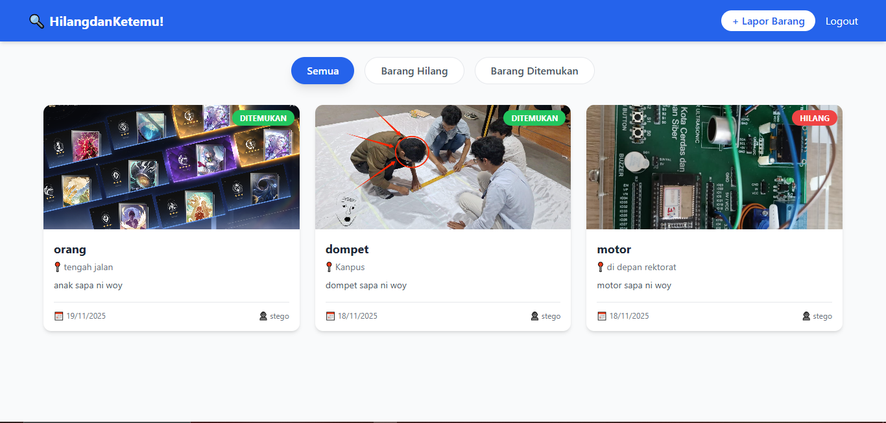

# 🔍 HilangdanKetemu

**Solusi Digital untuk Masalah Barang Hilang & Temuan di Lingkungan Kampus.**

> **Vibe Coding Week Submission**
>
> **Tema:** Solve a Real Problem
> **Stack:** MERN (MongoDB, Express, React, Node.js)

---

## 📖 Daftar Isi
- [🔍 HilangdanKetemu](#-hilangdanketemu)
  - [📖 Daftar Isi](#-daftar-isi)
  - [🚩 Latar Belakang Masalah](#-latar-belakang-masalah)
  - [💡 Solusi Kami](#-solusi-kami)
  - [🌟 Fitur Utama](#-fitur-utama)
    - [1. Autentikasi Aman (Auth)](#1-autentikasi-aman-auth)
    - [2. Pelaporan Barang (CRUD)](#2-pelaporan-barang-crud)
    - [3. Filter \& Navigasi](#3-filter--navigasi)
    - [4. User Experience (UI/UX)](#4-user-experience-uiux)
  - [🛠 Teknologi yang Digunakan](#-teknologi-yang-digunakan)
  - [🚀 Instalasi \& Cara Menjalankan](#-instalasi--cara-menjalankan)
    - [1. Clone Repository](#1-clone-repository)
    - [2. Setup dan Jalankan Backend](#2-setup-dan-jalankan-backend)
    - [3. Setup dan Jalankan Frontend](#3-setup-dan-jalankan-frontend)
  - [📸 Screenshot](#-screenshot)

---

## 🚩 Latar Belakang Masalah
Di lingkungan kampus atau komunitas, kehilangan barang pribadi (kunci, dompet, KTM, gadget) adalah hal yang sangat umum. Saat ini, proses pencarian barang hilang sangat tidak efisien karena:
1.  Informasi tersebar di puluhan grup WhatsApp/LINE yang berbeda.
2.  Papan pengumuman fisik ("Lost & Found") jarang diperhatikan.
3.  Informasi cepat tenggelam oleh chat lain, sehingga sulit dilacak kembali.
4.  Tidak ada database terpusat untuk mengecek barang temuan.

## 💡 Solusi Kami
**HilangdanKetemu** adalah aplikasi web sederhana namun berdampak, yang berfungsi sebagai database terpusat untuk pelaporan barang hilang dan temuan.

Dengan aplikasi ini:
* **Korban** bisa memposting barang yang hilang agar orang lain tahu.
* **Penemu** bisa memposting barang yang ditemukan lengkap dengan **foto bukti** dan lokasi.
* Semua orang bisa mencari (search/filter) barang berdasarkan status (Hilang/Ditemukan) secara real-time tanpa harus scroll grup chat.

---

## 🌟 Fitur Utama

### 1. Autentikasi Aman (Auth)
* Registrasi akun baru dengan validasi password.
* Login menggunakan JWT (JSON Web Token) untuk sesi yang aman.
* Logout user.

### 2. Pelaporan Barang (CRUD)
* **Create:** User bisa membuat laporan kehilangan atau penemuan barang.
* **Read:** Dashboard interaktif menampilkan semua laporan terbaru.
* **Upload Gambar:** Integrasi upload foto barang (bukti visual) agar identifikasi lebih akurat.

### 3. Filter & Navigasi
* Pemisahan tab antara barang **HILANG (LOST)** dan **DITEMUKAN (FOUND)**.
* Tampilan kartu (card) yang informatif dengan detail lokasi dan waktu.

### 4. User Experience (UI/UX)
* Desain responsif (Mobile & Desktop friendly).
* Feedback visual saat loading atau sukses upload.
* Antarmuka bersih menggunakan Tailwind CSS.

---

## 🛠 Teknologi yang Digunakan

**Frontend:**
* React.js (Vite)
* TypeScript
* Tailwind CSS
* Axios (API Consumption)
* React Router DOM

**Backend:**
* Node.js & Express.js
* MongoDB & Mongoose (Database)
* JWT (Authentication)
* Bcrypt (Password Hashing)
* Multer (File Upload Handling)

---

## 🚀 Instalasi & Cara Menjalankan

Pastikan kamu sudah menginstall **Node.js** dan **MongoDB** di komputer kamu.

### 1. Clone Repository
```bash
git clone https://github.com/username-kamu/HilangdanKetemu-web
cd HilangdanKetemu-web
```

### 2. Setup dan Jalankan Backend
```bash
cd backend
npm install
npm run dev
```

### 3. Setup dan Jalankan Frontend
```bash
cd frontend
npm install
npm run dev
```

## 📸 Screenshot
